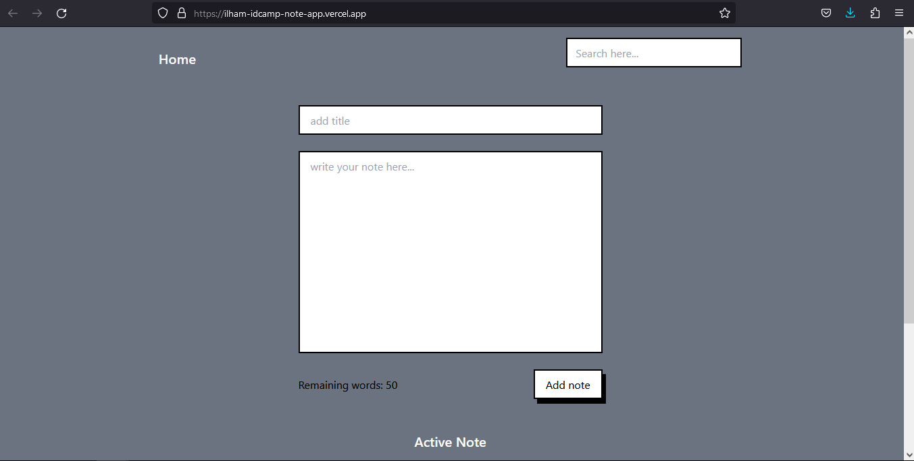
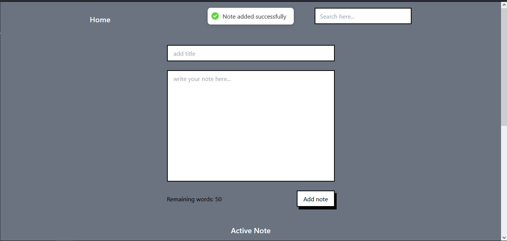
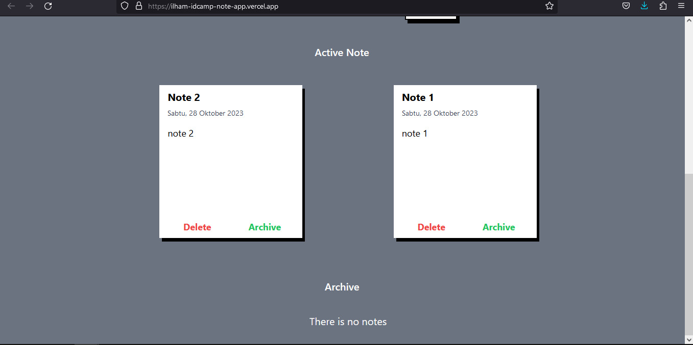
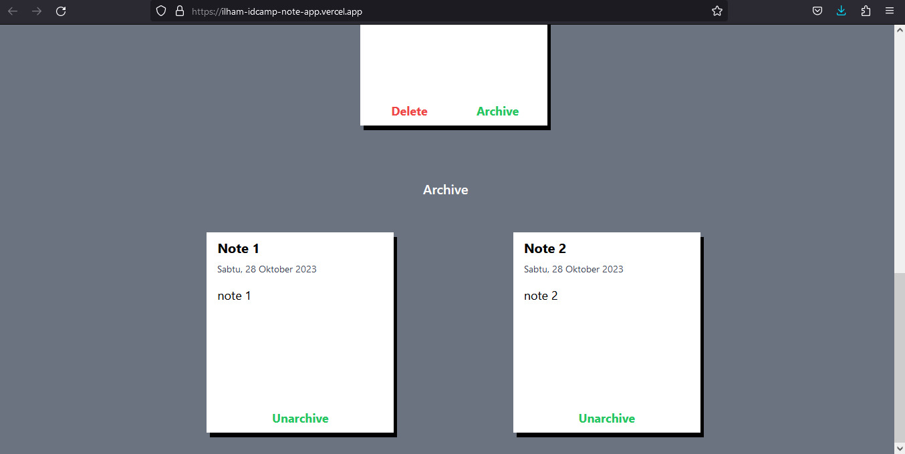
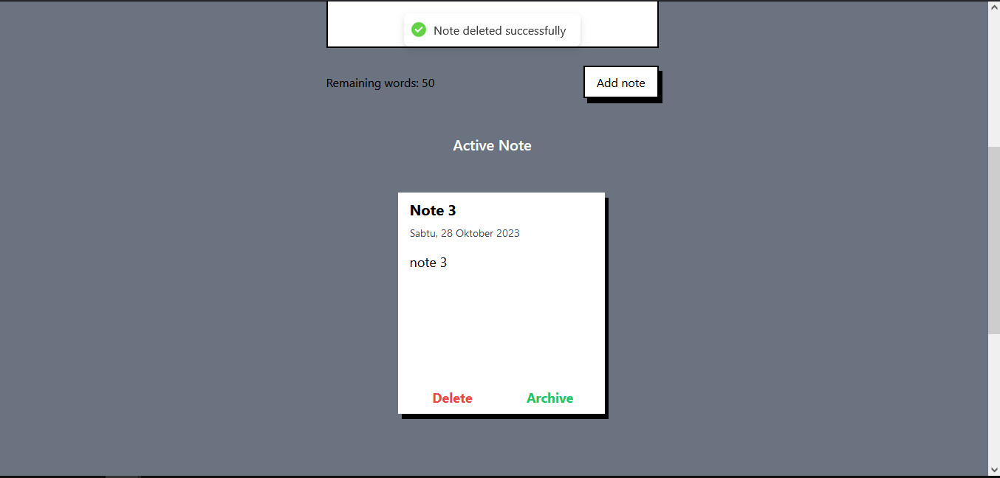

# React Note App

#

# ❓ The Brief…

This is a final project of ID Camp 2023. This project is from react developer class

#

#

# The Stack

1.Build with react js for the front end framework

#

2.Build with tailwind css for css framework

#

3.Using react hot toast to make beautiful alert

#

#

# The Features

1.User can add note

#

2.User can search note (refers to the title)

#

3.User can delete the note

#

4.User can archive the note

#

5.This app have limit for the caracter, if the user type more than that, user cannot add that note

#

6.If user add note or delete note, there will show alert from the react hot toast

#

#

# The Details

1.Already hosting in vercel : https://ilham-idcamp-note-app.vercel.app/

